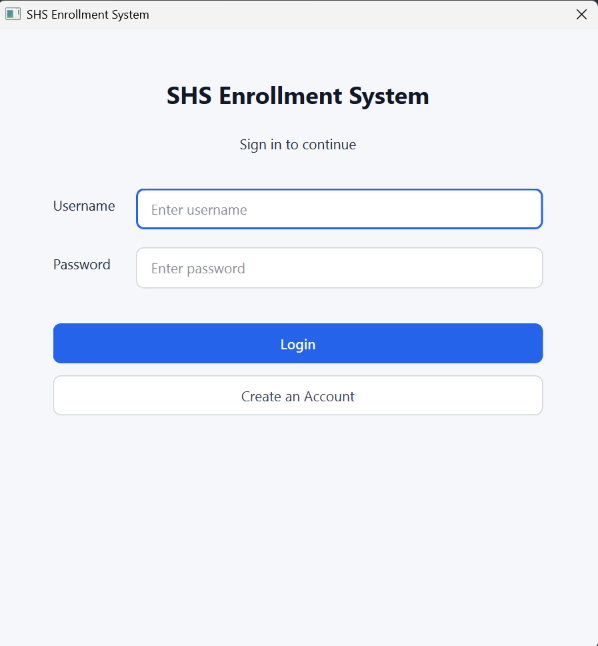
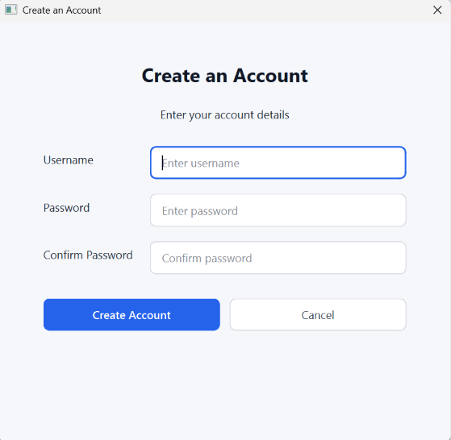
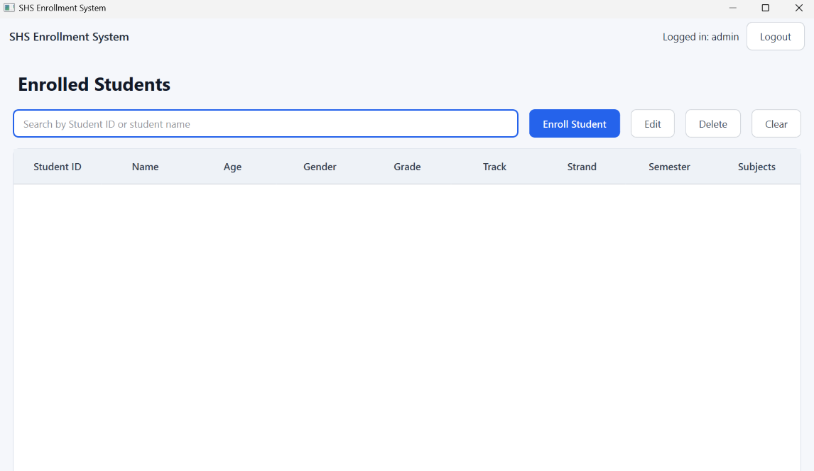
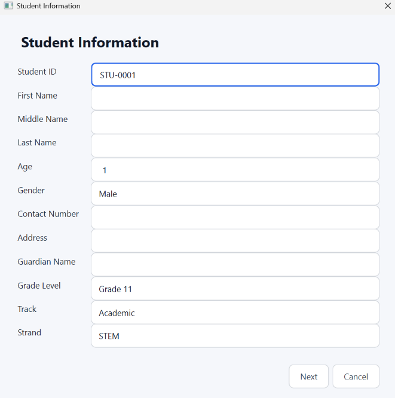
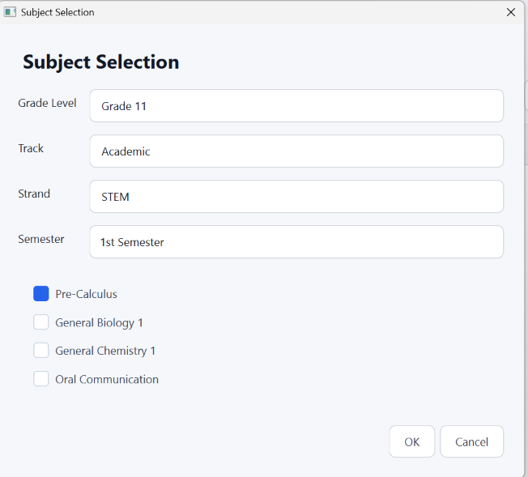
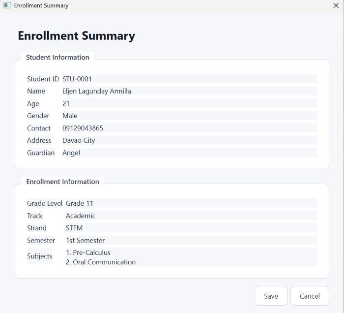
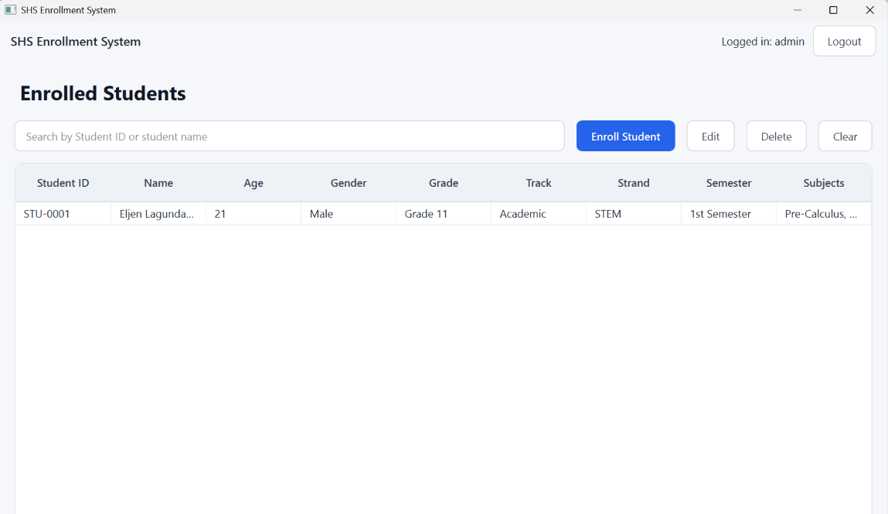

# Senior High School Enrollment System

## Project Description

The **Senior High School Enrollment System** is a desktop-based enrollment application developed using Python, PyQt6, and SQLite. It provides a graphical interface for managing Senior High School student enrollment records.

The system allows users to create an account, log in, enter student information, select a grade level, track, strand, semester, and subjects, and save the enrollment record. It also provides functions for viewing, searching, editing, and deleting enrollment records.

The project addresses the need for an organized way of managing student enrollment information. Instead of handling enrollment records manually, the system stores student and enrollment information in an SQLite database and provides a graphical interface for managing the records.

## Project Objectives

1. To develop a graphical Senior High School enrollment system using Python and PyQt6.
2. To organize and store student and enrollment information using SQLite.
3. To provide a simple interface for adding student enrollment records.
4. To allow users to select subjects based on grade level, track, strand, and semester.
5. To provide functions for searching, viewing, editing, and deleting enrollment records.
6. To apply object-oriented programming concepts in developing the system.
7. To practice database operations such as Create, Read, Update, Delete, and Search.

## Features

### User Login
Registered users can enter their username and password to access the system.

### Account Registration
New users can create an account. The system validates required fields, username length, password length, and password confirmation.

### Student Enrollment
The system collects student information including Student ID, name, age, gender, contact number, address, guardian, grade level, track, and strand.

### Automatic Student ID
A new student ID is generated automatically using the `STU-0001` format.

### Track and Strand Selection
The system supports:

**Academic**
- STEM
- ABM
- HUMSS
- GAS

**TVL**
- ICT - Programming
- ICT - CSS

### Subject Selection
Subjects are loaded according to the selected grade level, track, strand, and semester.

### Enrollment Summary
Before saving, the system displays a summary of the student's information, enrollment information, and selected subjects.

### Search
The main enrollment table provides searching by Student ID or student name.

### View Student Details
A selected enrollment can be opened to view the student's information, enrollment information, and subjects.

### Edit Enrollment
Existing enrollment records can be edited, including student information and selected subjects.

### Delete Enrollment
An enrollment can be deleted after confirmation.

### Logout
The user can log out and return to the login screen.

## Technologies Used

| Technology | Purpose |
|---|---|
| Python | Main programming language |
| PyQt6 | Graphical user interface |
| SQLite | Database |
| QSS | Application styling |
| Git | Version control |
| GitHub | Project repository |
| PyCharm | Development environment |

## Project Structure

```text
MedyoFinal/
├── .venv/
├── database/
│   ├── __init__.py
│   └── database.py
├── features/
│   ├── __init__.py
│   ├── authentication/
│   │   ├── __init__.py
│   │   ├── service.py
│   │   └── view.py
│   └── enrollments/
│       ├── __init__.py
│       ├── service.py
│       └── views/
│           ├── __init__.py
│           ├── enrollment_view.py
│           ├── student_dialog.py
│           ├── student_view.py
│           ├── subject_dialog.py
│           └── summary_dialog.py
├── main.py
└── style.qss
```

### Major Files and Folders

- **`database/`** - Contains database-related code.
- **`database.py`** - Creates the SQLite connection, tables, and initial subject/user data.
- **`features/authentication/`** - Contains login and account registration.
- **`authentication/service.py`** - Handles authentication database operations.
- **`authentication/view.py`** - Provides the login and sign-up interfaces.
- **`features/enrollments/`** - Contains enrollment functionality.
- **`enrollments/service.py`** - Handles enrollment database operations.
- **`enrollments/views/`** - Contains the enrollment-related graphical interfaces.
- **`enrollment_view.py`** - Displays and manages enrollment records.
- **`student_dialog.py`** - Collects student information and enrollment selections.
- **`subject_dialog.py`** - Handles subject selection.
- **`summary_dialog.py`** - Displays the enrollment summary.
- **`student_view.py`** - Displays detailed student information.
- **`main.py`** - Starts and controls the application.
- **`style.qss`** - Defines the application's visual style.

## Installation and Setup

### Requirements

- Python
- PyQt6
- SQLite
- Git
- PyCharm or another Python-compatible IDE

### Step 1: Clone the Repository

```bash
git clone https://github.com/doughdong/SHSEnrollmentSystemV2.git
cd SHSEnrollmentSystemV2
```

### Step 2: Create a Virtual Environment

```bash
python -m venv .venv
```

### Step 3: Activate the Virtual Environment

For Windows:

```bash
.venv\Scripts\activate
```

### Step 4: Install PyQt6

```bash
pip install PyQt6
```

### Step 5: Run the Application

```bash
python main.py
```

The SQLite database is created automatically when the application starts.

## How to Use the System

1. Open the application.
2. Log in using a registered account.
3. To create an account, use **Create an Account** from the login screen.
4. From the main window, click **Enroll Student**.
5. Enter the student's information.
6. Select Grade Level, Track, and Strand.
7. Select the semester and subjects.
8. Review the Enrollment Summary.
9. Click **Save**.
10. Use the enrollment table to search, view, edit, or delete records.
11. Click **Logout** to return to the login screen.

### Default Account

```text
Username: admin
Password: admin123
```

## OOP Implementation

The system uses classes to organize related data and operations.

### Important Classes

| Class | Purpose |
|---|---|
| `Database` | Manages SQLite connections, tables, and seed data. |
| `AuthenticationService` | Handles login and account registration. |
| `AuthenticationView` | Provides the login interface. |
| `SignupDialog` | Provides account registration. |
| `EnrollmentService` | Handles enrollment database operations. |
| `EnrollmentView` | Displays and manages enrollment records. |
| `StudentInformationDialog` | Collects student information. |
| `SubjectSelectionDialog` | Handles subject selection. |
| `EnrollmentSummaryDialog` | Displays the enrollment summary. |
| `StudentViewDialog` | Displays student details. |
| `MainWindow` | Displays the main application window. |
| `ApplicationController` | Controls the login and main-window flow. |

### Encapsulation

Encapsulation is applied by grouping related operations inside classes. For example, `AuthenticationService` contains authentication operations while `EnrollmentService` contains enrollment operations.

### Inheritance

The project uses inheritance from PyQt6 classes. Examples include:

```python
class MainWindow(QMainWindow):
class AuthenticationView(QDialog):
class SignupDialog(QDialog):
class EnrollmentView(QWidget):
class StudentInformationDialog(QDialog):
class SubjectSelectionDialog(QDialog):
class EnrollmentSummaryDialog(QDialog):
class StudentViewDialog(QDialog):
```

### Polymorphism

Polymorphism is applied through the inherited PyQt6 interfaces and methods. The custom classes use the behavior provided by their PyQt6 parent classes while implementing their own application-specific behavior.

## Database

The project uses **SQLite**.

The database is initialized through `database/database.py`. The application creates the required tables when it starts.

### Database Tables

#### `users`
Stores registered user accounts.

Important fields:
- `id`
- `username`
- `password`

#### `students`
Stores student personal information.

Important fields:
- `id`
- `student_id`
- `first_name`
- `middle_name`
- `last_name`
- `age`
- `gender`
- `contact`
- `address`
- `guardian`

#### `subjects`
Stores available subjects according to grade level, track, strand, and semester.

Important fields:
- `id`
- `grade_level`
- `track`
- `strand`
- `semester`
- `subject_name`

#### `enrollments`
Stores a student's enrollment information.

Important fields:
- `id`
- `student_id`
- `grade_level`
- `track`
- `strand`
- `semester`

#### `enrollment_subjects`
Stores the subjects selected for each enrollment.

Important fields:
- `id`
- `enrollment_id`
- `subject_name`

### Database Operations

**Create**
- Creates user accounts.
- Creates student records.
- Creates enrollment records.
- Creates enrollment subject records.

**Read**
- Reads user accounts for login.
- Retrieves available subjects.
- Retrieves enrollment records.
- Retrieves enrolled subjects.

**Update**
- Updates student information.
- Updates grade level, track, strand, and semester.
- Replaces selected subjects during an enrollment update.

**Delete**
- Deletes enrollment subject records.
- Deletes enrollment records.
- Deletes the associated student record.

**Search**
- Searches enrollment records by Student ID or student name.

## Screenshots

### 1. Login Screen

The login screen allows a registered user to enter a username and password.



### 2. Create an Account

The account registration screen allows a new user to enter a username, password, and password confirmation.



### 3. Enrolled Students

The main enrollment window displays the student enrollment table and controls for enrollment management.



### 4. Student Information

The student information form collects the student's personal information and enrollment classification.



### 5. Subject Selection

The subject selection screen displays subjects based on the student's grade level, track, strand, and selected semester.



### 6. Enrollment Summary

The enrollment summary allows the user to review the student's information and selected subjects before saving.



### 7. Enrolled Student Record

After enrollment, the main table displays the saved student's enrollment record.



## Testing

The provided screenshots demonstrate the following application flow:

| Test | Expected Result | Evidence |
|---|---|---|
| Open login screen | Login interface is displayed | Login screenshot |
| Open account registration | Create Account dialog is displayed | Create Account screenshot |
| Open enrollment | Student Information dialog is displayed | Student Information screenshot |
| Select subjects | Available subjects are displayed according to the selected enrollment information | Subject Selection screenshot |
| Review enrollment | Enrollment Summary displays student and enrollment information | Enrollment Summary screenshot |
| Save enrollment | Enrollment record appears in the main student table | Saved Enrollment screenshot |

The source code also implements search, view, edit, delete, and logout functions. These functions should be included in final execution testing if required by the instructor.

## Known Issues / Limitations

1. Passwords are stored as plain text in the SQLite database.
2. The application is a local desktop application and uses SQLite rather than a remote database.
3. Subjects are seeded in the database and are not managed through a separate subject-management interface.
4. The available tracks and strands are predefined in the application.
5. The system does not currently implement advanced user roles and permissions.
6. The project does not include a web-based or cloud-based version.

## Author

**Name:** Eljen Armilla  
**Section:** BSCS 2nd Year


